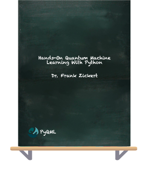
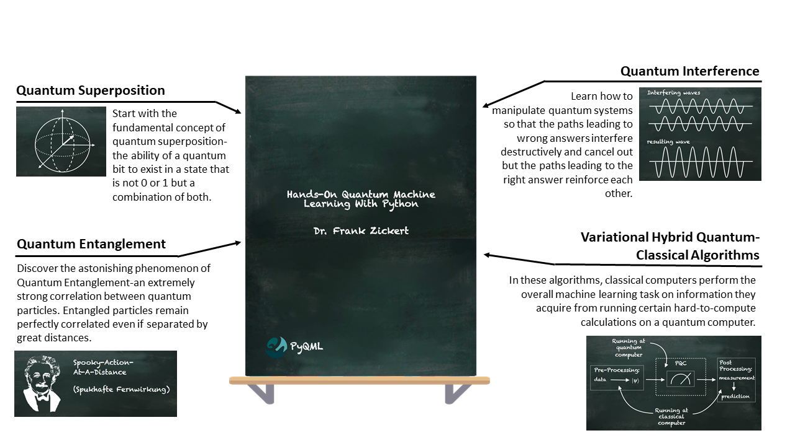

# Hands-On Quantum Machine Learning With Python

This repository contains the source code listings of the book **Hands-On Quantum Machine Learning With Python**.

## You're interested in quantum computing and machine learning...

## ...But you don't know how to get started? Let me help!

Whether you just get started with quantum computing and machine learning or you're already a senior machine learning engineer, Hands-On Quantum Machine Learning With Python is your comprehensive guide to get started with Quantum Machine Learning - the use of quantum computing for the computation of machine learning algorithms.

**Do you want to get your copy?**

Visit [https://www.pyqml.com](https://www.pyqml.com)!

## Master Quantum Machine Learning With Lots of Examples

Quantum computing promises to solve problems intractable with current computing technologies. But is it fundamentally different and asks us to change the way we think.

Hands-On Quantum Machine Learning With Python strives to be the perfect balance between theory taught in a textbook and the actual hands-on knowledge you’ll need to implement real-world solutions.

Inside this book, you will learn the basics of quantum computing and machine learning in a practical and applied manner.

Hands-On Quantum Machine Learning With Python provides a no-nonsense teaching style guaranteed to cut through all the cruft and help you master Quantum Machine Learning

Hands-on tutorials (with lots of code) that not only show you the concepts of quantum computing and the algorithms behind machine learning but their implementations as well.